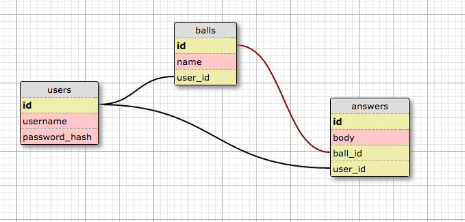

#### Magic 8 Ball Simulator

### Purpose

Web app simulating the functionality of [Magic 8 Ball™](https://en.wikipedia.org/wiki/Magic_8-Ball "Wikipedia"). Built on Sinatra Skeleton provided by Dev Bootcamp.

## User Stories

1. As a user, I'd like to shake the ball and be told a random deafult set of answers for my question.
2. As a user, aside from the default set, I'd like to be able to create, edit or delete my own custom predictions.
3. As a user, I'd like to create separate customized 8-Balls.
3. As a developer, I wish to be able to secure and protect the user's personal credentials.
4. As an ISP, I'd like for the developer to use AJAX calls to minimize the number of requests made per game.

## Schema:

